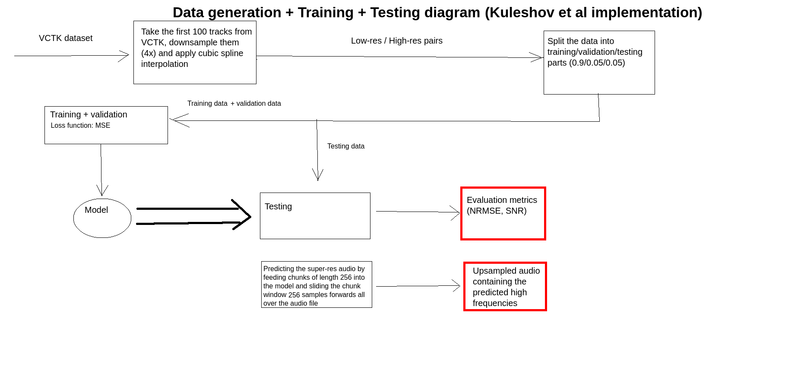
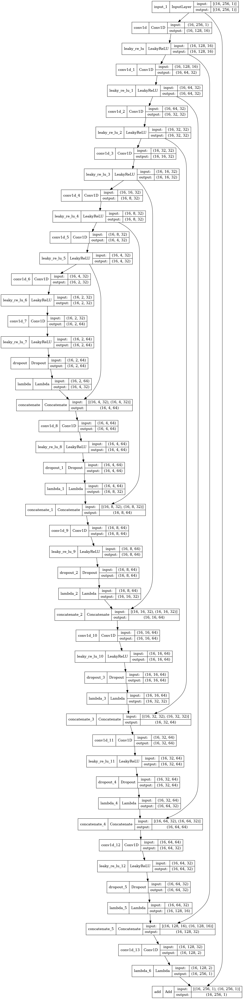
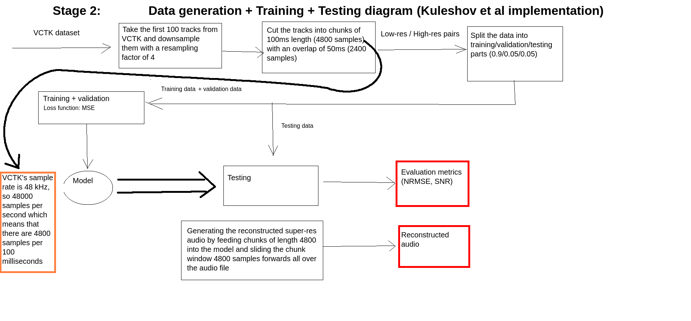
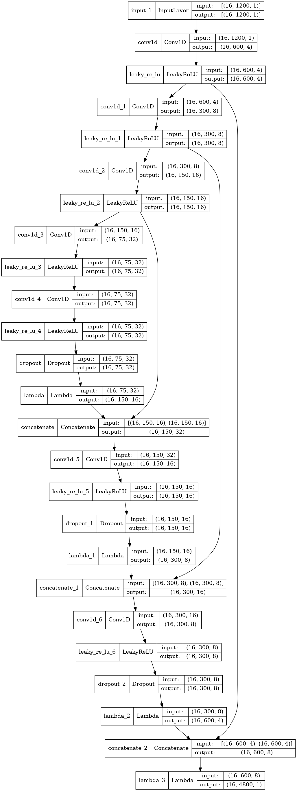
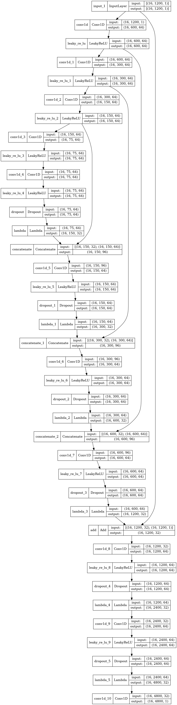
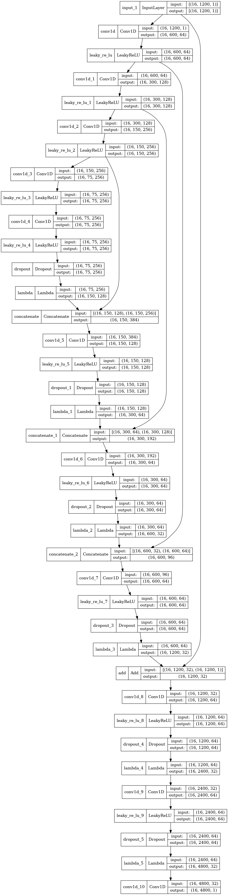
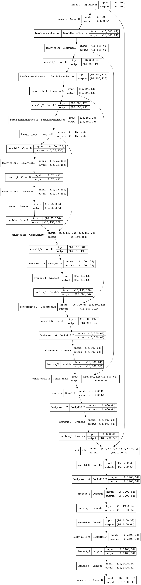
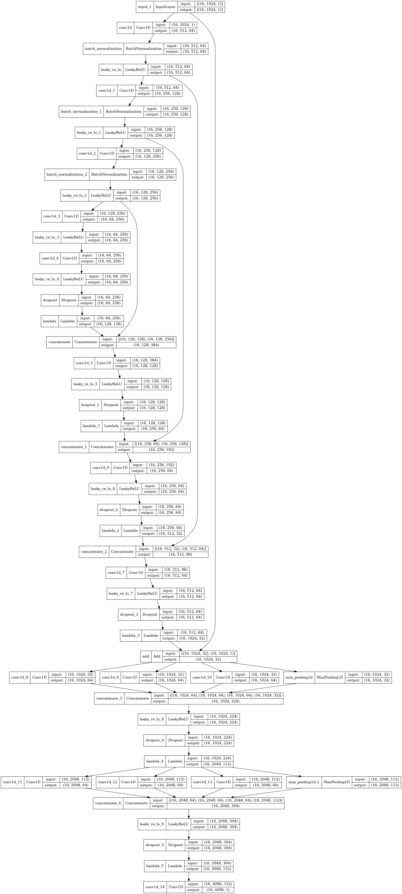

# Audio Super-Resolution
A project focused on the super-resolution of audio signals i.e improving sound quality of a digital recording, be it a vocal recording or music. 

## Dataset
The datasets used will be VCTK and some music dataset, possibly MagnaTagATune or The Million Song dataset.

## Main references
 - [X] [Audio Super-Resolution Using Neural Nets](https://arxiv.org/pdf/1708.00853v1.pdf)
 - [X] [Time-frequency Networks For Audio Super-Resolution](https://teckyianlim.me/audio-sr/res/3828.pdf)
 - [X] [Bandwidth extension on raw audio via generative adversarial networks](https://arxiv.org/pdf/1903.09027.pdf)

## Related papers that could be used as references

### Audio signals
 - [Adversarial Training for Speech Super-Resolution](https://www.researchgate.net/publication/332201260_Adversarial_Training_for_Speech_Super-Resolution)
 - [Phase-aware music super-resolution using generative adversarial networks](https://arxiv.org/pdf/2010.04506.pdf)
 - [MidiNet: A Convolutional Generative Adversarial Network for Symbolic-domain Music Generation](https://arxiv.org/pdf/1703.10847.pdf)
 - [On the evaluation of generative models in music](https://musicinformatics.gatech.edu/wp-content_nondefault/uploads/2018/11/postprint.pdf)
 - [INCO-GAN: Variable-Length Music Generation Method Based
on Inception Model-Based Conditional GAN](https://www.google.com/url?sa=t&rct=j&q=&esrc=s&source=web&cd=&ved=2ahUKEwj62YWr14_0AhXch_0HHf0dDckQFnoECAQQAQ&url=https%3A%2F%2Fwww.mdpi.com%2F2227-7390%2F9%2F4%2F387%2Fpdf&usg=AOvVaw1Bt1-i7aM7Fp8OmwRJ2GtX)
 - [WSRGlow: A Glow-based Waveform Generative Model for Audio Super-Resolution](https://arxiv.org/abs/2106.08507)
 - [Self-Attention for Audio Super-Resolution](https://arxiv.org/pdf/2108.11637v1.pdf)
 - [On Filter Generalization for Music Bandwidth Extension Using Deep Neural Networks](https://arxiv.org/pdf/2011.07274v2.pdf)
 - [NU-Wave: A Diffusion Probabilistic Model for Neural Audio Upsampling](https://arxiv.org/pdf/2104.02321v2.pdf)
 - [Temporal FiLM: Capturing Long-Range Sequence Dependencies with Feature-Wise Modulation](https://arxiv.org/pdf/1909.06628v3.pdf)
 - [Learning Continuous Representation of Audio for Arbitrary Scale Super Resolution](https://arxiv.org/pdf/2111.00195.pdf)
 - [An investigation of pre-upsampling generative modelling and Generative Adversarial Networks in audio super resolution](https://arxiv.org/pdf/2109.14994.pdf)
 - [TUNet: A Block-online Bandwidth Extension Model based on Transformers and Self-supervised Pretraining](https://arxiv.org/pdf/2110.13492v3.pdf)
 - [Vision-Infused Deep Audio Inpainting](https://arxiv.org/pdf/1910.10997.pdf)
 - [VoiceFixer: Toward General Speech Restoration with Neural Vocoder](https://arxiv.org/pdf/2109.13731.pdf)
 - [Sound field reconstruction in rooms: inpainting
meets super-resolution](https://arxiv.org/pdf/2001.11263.pdf)
 - [High-quality Speech Synthesis Using Super-resolution Mel-Spectrogram ](https://arxiv.org/pdf/1912.01167.pdf)
 - [Enabling Real-time On-chip Audio Super Resolution for Bone
Conduction Microphones](https://arxiv.org/pdf/2112.13156.pdf)
 - [Speech bandwidth expansion based on Deep Neural Networks](https://www.researchgate.net/publication/325682935_Speech_bandwidth_expansion_based_on_Deep_Neural_Networks)
 - [Speech Audio Super-Resolution For Speech Recognition](https://www.researchgate.net/publication/334559270_Speech_Audio_Super-Resolution_For_Speech_Recognition)
 - [WaveNet: A Generative Model for Raw Audio](https://arxiv.org/pdf/1609.03499.pdf)

### Image super-resolution 
 - [Photo-Realistic Single Image Super-Resolution Using a Generative Adversarial Network](https://arxiv.org/pdf/1609.04802.pdf)
 - [Multi-Scale Inception Based Super-Resolution Using
Deep Learning Approach](https://www.google.com/url?sa=t&rct=j&q=&esrc=s&source=web&cd=&ved=2ahUKEwjmhZCKx8D2AhWVuaQKHW1qCe8QFnoECC0QAQ&url=https%3A%2F%2Fwww.mdpi.com%2F2079-9292%2F8%2F8%2F892%2Fpdf&usg=AOvVaw2WyUhO-sgVVwr-2nGleuwj)

### Time-series
 - [Imaging Time-Series to Improve Classification and Imputation](https://arxiv.org/pdf/1506.00327.pdf)
 - [Use of recurrence plots for identification and extraction of patterns
in humpback whale song recordings](https://hal.archives-ouvertes.fr/hal-03008908/document)
 - [A Brief Introduction to Nonlinear Time Series
Analysis and Recurrence Plots](https://www.google.com/url?sa=t&rct=j&q=&esrc=s&source=web&cd=&ved=2ahUKEwiurbSOzMD2AhWZwQIHHVfXAv0QFnoECB8QAQ&url=https%3A%2F%2Fwww.mdpi.com%2F2571-631X%2F2%2F4%2F21%2Fpdf&usg=AOvVaw3MZO9ulox-jpl4vyifUFRy)

### Generative models
 - [Wasserstein GANs](https://arxiv.org/pdf/1701.07875.pdf)
 - [Neural Photo Editing with Introspective Adversarial Networks](https://arxiv.org/pdf/1609.07093v3.pdf)

### Deep Learning
 - [Understanding the Disharmony between Dropout and Batch Normalization by
Variance Shift](https://arxiv.org/pdf/1801.05134.pdf)
 - [Fast Fourier Convolution](https://proceedings.neurips.cc/paper/2020/file/2fd5d41ec6cfab47e32164d5624269b1-Paper.pdf)
 - [Competitive Multi-scale Convolution](https://arxiv.org/pdf/1511.05635.pdf)
 - [Efficient and Generic 1D Dilated Convolution Layer for Deep
Learning](https://arxiv.org/pdf/2104.08002.pdf)
 - [Multi-Scale Convolutional Neural Networks for Time Series
Classification](https://arxiv.org/pdf/1603.06995.pdf)
 - [Inception-v4, Inception-ResNet and
the Impact of Residual Connections on Learning](https://arxiv.org/pdf/1602.07261v2.pdf)

### Blogs
 - [Using Deep-Learning to Reconstruct High-Resolution Audio](https://blog.insightdatascience.com/using-deep-learning-to-reconstruct-high-resolution-audio-29deee8b7ccd)
 - [Separate Music Tracks with Deep Learning](https://towardsdatascience.com/separate-music-tracks-with-deep-learning-be4cf4a2c83)
 - [A Simple Guide to the Versions of the Inception Network](https://towardsdatascience.com/a-simple-guide-to-the-versions-of-the-inception-network-7fc52b863202)

### Datasets
 - [The Million Song Dataset](https://www.ee.columbia.edu/~dpwe/pubs/BertEWL11-msd.pdf)

### Other
 - [Ablation studies video](https://www.youtube.com/watch?v=4Ko-wt0aITg)
 - [What is an ablation study?](https://stats.stackexchange.com/questions/380040/what-is-an-ablation-study-and-is-there-a-systematic-way-to-perform-it)
 - [Steps to start training your custom Tensorflow model in AWS SageMaker](https://towardsdatascience.com/steps-to-start-training-your-custom-tensorflow-model-in-aws-sagemaker-ae9cf7a205b9)
 - [Loss suddenly increasing](https://stats.stackexchange.com/questions/320631/how-can-my-loss-suddenly-increase-while-training-a-cnn-for-image-segmentation)
 - [NaN loss](https://stackoverflow.com/questions/40050397/deep-learning-nan-loss-reasons)
 - [Gradient clipping in Keras](https://stackoverflow.com/questions/47778292/gradient-clipping-in-keras)
 - [How to use Learning Curves to Diagnose Machine Learning Model Performance](https://machinelearningmastery.com/learning-curves-for-diagnosing-machine-learning-model-performance/)
 - [Validation Error less than training error](https://stats.stackexchange.com/questions/187335/validation-error-less-than-training-error)
 - [How to successfully add large data sets to Google Drive](https://towardsdatascience.com/how-to-successfully-add-large-data-sets-to-google-drive-130beb320f1a)

## Possible uses
 - Improving sound quality of music
	- insanely experimental and slightly unrealistic idea: use [Deezer's model for separating tracks of a song](https://towardsdatascience.com/separate-music-tracks-with-deep-learning-be4cf4a2c83) and apply transfer learning to upsample each track separately (train a model with low-res/high-res guitar tracks, one with bass tracks, one for drums and another for voice tracks)  
 - Voice-over-IP applications
 - Improving speech recognition
 - Remastering audio from old movies
 - Reconstructing old phonograph recordings (This one might be a bit far-fetched, since a lot of data is needed. It might actually be impossible.)

## Converting a spectrogram to audio (might be useful later)
The Python module [librosa](https://librosa.org/doc/latest/index.html) can transform an audio signal into a spectrogram and vice-versa
by using the [Griffin-Lim algorithm](https://stackoverflow.com/questions/61132574/can-i-convert-spectrograms-generated-with-librosa-back-to-audio).

## Math and signal processing links 
 - [What is convolution? This is the easiest way to understand](https://www.youtube.com/watch?v=QmcoPYUfbJ8)
 - [Introducing Convolutions](https://www.youtube.com/watch?v=N-zd-T17uiE)
 - [Valerio Velardo's Audio Signal Processing for Machine Learning Playlist](https://www.youtube.com/watch?v=iCwMQJnKk2c&list=PL-wATfeyAMNqIee7cH3q1bh4QJFAaeNv0)
 - [Steve Brunton's Fourier Analysis Playlist](https://www.youtube.com/watch?v=jNC0jxb0OxE&list=PLMrJAkhIeNNT_Xh3Oy0Y4LTj0Oxo8GqsC)
 - [Sampling, Aliasing & Nyquist Theorem](https://www.youtube.com/watch?v=yWqrx08UeUs)
 - [Interpolation](https://www.youtube.com/watch?v=RpxoN9-i7Jc)
 - [Wave phase](https://www.youtube.com/watch?v=yKL6DjqAm3I)
 - [What is phase in audio?](https://www.youtube.com/watch?v=QritRLa-Jt4)
 - [Difference between logged-power spectrum and power spectrum](https://dsp.stackexchange.com/questions/38319/difference-between-logged-power-spectrum-and-power-spectrum)
 - [Linear and logarithmic scales](https://www.indeed.com/career-advice/career-development/logarithmic-scale)
 - [Decibel conversion](https://dspillustrations.com/pages/posts/misc/decibel-conversion-factor-10-or-factor-20.html?rid=so6)
 - [Why do we modulate signals?](https://www.geeksforgeeks.org/need-of-modulation-in-communication-systems/)
 - [Modulation vs. convolution](https://www.quora.com/What-is-the-difference-between-modulation-of-two-signals-and-convolution-of-two-signals)
 - [Discrete Fourier Transform explained with example](https://www.youtube.com/watch?v=QcF9CMz8Bcc)
 - [DC offset](https://en.wikipedia.org/wiki/DC_bias)
 - [The FFT algorithm - simple step by step explanation](https://www.youtube.com/watch?v=htCj9exbGo0)

## Research advices
 - [How to Read AI (Audio) Research Papers Like a Rockstar](https://www.youtube.com/watch?v=tBoSIzilP-Y)
	1. Skimming
		- read the abstract
		- read introduction + conclusion
		- check out figures and tables
		- ignore details	

	2. Reading the details
		- What's the state-of-the-art?
		- What are the tools/techniques used?
		- How did the authors evaluate their solution?
		- What are the results of the experiments?

	3. Question everything
		- Do I understand everything the authors say?
		- Is the paper sound?
		- What would I have done differently?
		- Read referenced research papers
		- Internalise the math
		- Re-think the problem
		- Explain the paper to friends/colleagues

	4. Check the code
		- Check the author's implementation
		- Re-implement the proposed solution
		- Run experiments

 - [How to Conduct Literature Review Effectively](https://www.youtube.com/watch?v=FRdVqWquroc) 

	Select resource &rarr; Read resource &rarr; Take notes (topic, approach, results, contributions, limitations/weaknesses) &rarr; Keep track of reference &rarr; Summarise literature review findings

 - [How to Select AI (Audio) Papers Effectively](https://www.youtube.com/watch?v=UEdWuu8hqrg)

 - [How to Summarize a Research Article](https://writingcenter.uconn.edu/wp-content/uploads/sites/593/2014/06/How_to_Summarize_a_Research_Article1.pdf)

## Outline idea
- Introduction
	- Problem statement (what, why, how)

- Theory
	- Neural nets/CNNs
	- Image super-resolution
	- Time series super-resolution
	- Autoencoders and U-Nets (state-of-the-art) - Audio super-resolution - literature review
	- Time-series analysis - basic concepts (frequency spectrum, Fourier transform, spectrograms, sample rate)

- My contributions 
	- Multiscale convolutions 
		or
	- Encoding the time-domain representation as images (GAFs, MTFs, recurrence plots or some other time-series imaging technique)

- Experiments and results evaluation (metrics, tables etc.)
	-> dataset details (exploratory data analysis: histograms, spectrograms etc.)

- Spring/Angular project description
- Conclusion

## A quick implementation of ["Audio Super Resolution Using Neural Networks (Kuleshov, Enam, Ermon, 2017)"](https://arxiv.org/pdf/1708.00853v1.pdf)

### First stage

  

 - [X] Write the data generator scripts (obtaining the low-res/high-res pairs of audio clips)
 - [X] Write the training/testing scripts 
 - [X] read more about why the loss approaches the nan value during training 
	 -  usually, it is either because of an exploding gradient or a vanishing gradient (in my case, I accidentally used NRMSE as a loss function instead of using it only as a metric, the number was so small that Keras displayed the loss as being "nan")
	 - relevant StackOverflow post: https://stackoverflow.com/questions/37232782/nan-loss-when-training-regression-network 
 - [X] create plots with the training and validation loss
 - [X] train 100 epochs
 - [X] adjust the data split to use all of the generated data from the first 100 tracks of VCTK for training/validation/testing
 - [X] Finish testing/prediction script:
	- [X] Downsample test audio track
	- [X] Feed chunks of 256 samples of the audio to the model 
	- [X] Display spectrogram of the output
	- [X] Save the low-res/high-res/super-res numpy arrays as audio and compare them

### Second stage

  

 - [X] Display the 5-number summary / boxplot of the generated dataset
 - [X] Create line plot of a couple of random samples (both in time-domain and in frequency-domain)
 - [X] Create histogram of a single sample 
 - [X] Check what size a chunk could have (transform the numpy array chunk of size n to WAV and listen to the result)
 - [X] Implement checkpoint restoration
 - [X] Generate the dataset again with a chunk size of 4800 samples (100ms), an overlap of 2400 samples (50ms) and a downsampling factor of 4 (the reason for this patch size is that the paper mentions a similar size of 6000 samples used in 400 training epochs) 
	- [X] Use 4 processes to speed up the data generation 
 - [X] Add 3 more upsampling blocks (a subpixel layer is not enough to upsample a 1200-sample tensor to 4800 samples and has no parameters)
 - [X] Reconstruct the low-resolution signal without applying interpolation (e.g a 100-sample chunk downsampled with a factor of 4 becomes a chunk of length 25, which will be fed to the network as-is without interpolation)
 - [X] Get evaluation metrics (NRMSE comparisons for the high-res/super-res signals and the high-res/interpolated signals)
 - [X] Display some scatterplots
 - [X] Compare the 5e-4 learning rate model with the 100-epoch 1e-4 model and the 200-epoch 1e-4 model

### 3rd stage

 - [X] Increase the number of filters in the Conv1D layers from 32 to 64 and train

### 4th stage

 
 - [X] Set the filter no. configuration to 64-128-256-256-256-128-64, with the last 2 upsampling blocks retaining the 64-64 arrangement

### 5th stage

 - [X] Add BatchNorm to the downsampling blocks

### 6th stage

 - [X] Perform an ablation study to analyze how much each residual block contributes to the noise found in the model output

### 7th stage

 - [X] Replace the normal convolutions with depthwise separable 1D convolutions as an experiment

<table class="demo">
	<caption>Table 1</caption>
	<colgroup span="3"></colgroup>
	<colgroup span="3"></colgroup>
	<colgroup span="3"></colgroup>
	<thead>
		<tr>
			  <th colspan="3" scope="colgroup">3-layer model</th>
			  <th colspan="3" scope="colgroup">4-layer model</th>
			  <th colspan="3" scope="colgroup">5-layer model</th>
		</tr>
	</thead>
	<tbody>
	<tr>
				<td>
					MSE
				</td>
				<td>
					SNR
				</td>
				<td>
					NRMSE
				</td>
				<td>
					MSE
				</td>
				<td>
					SNR
				</td>
				<td>
					NRMSE
				</td>
				<td>
					MSE
				</td>
				<td>
					SNR
				</td>
				<td>
					NRMSE
				</td>
	</tr>
	<tr>
				<td>
					67485
				</td>
				<td>
					19.48
				</td>
				<td>
					0.0053
				</td>
				<td>
					66944
				</td>
				<td>
					19.46
				</td>
				<td>
					0.0053
				</td>
				<td>
					68185
				</td>
				<td>
					19.53
				</td>
				<td>
					0.0053
				</td>
	</tr>
	</tbody>
</table>
